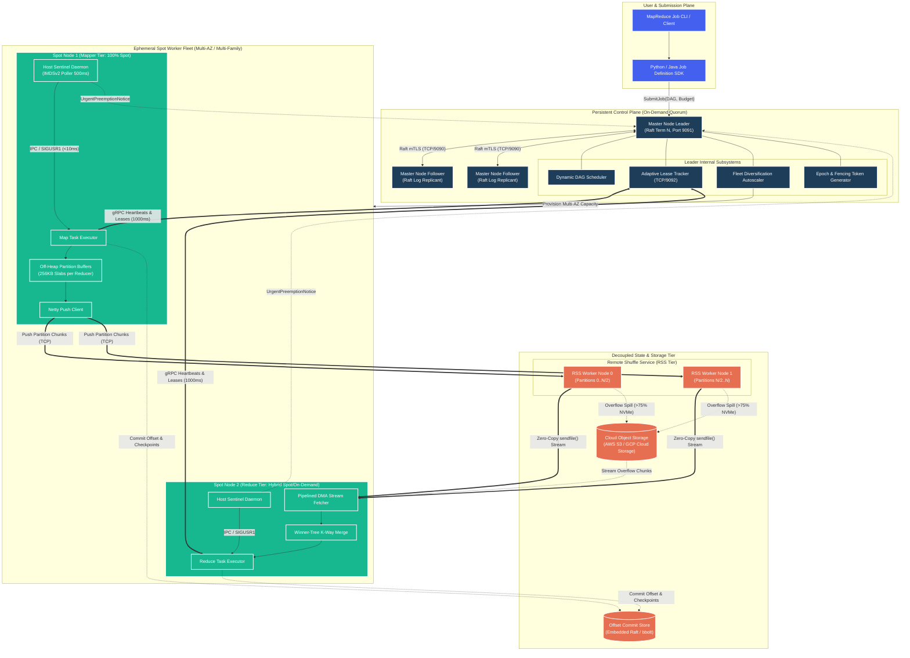
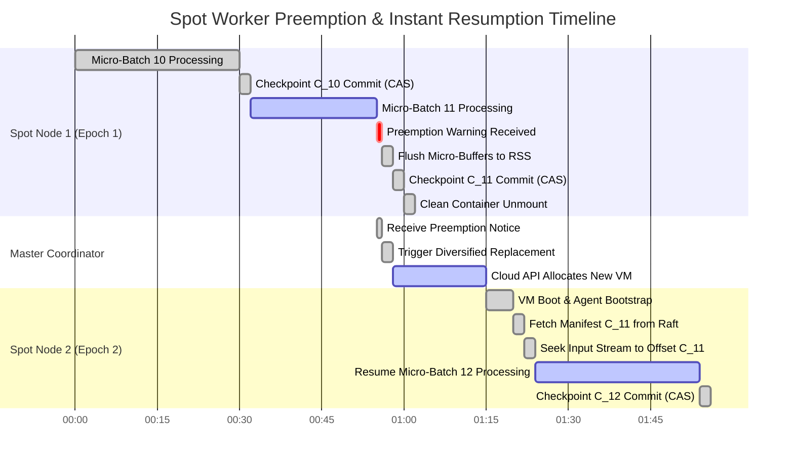

# Transient Spot-Instance MapReduce Framework: End-to-End Architecture & Implementation Roadmap

---

## 1. System Overview & Architectural Paradigm

The **Transient Spot-Instance MapReduce Framework** is an enterprise-grade distributed batch computation engine engineered to operate reliably on volatile cloud capacity (AWS EC2 Spot Instances, GCP Spot/Preemptible VMs). By completely decoupling compute workers from state persistence and treating node termination as a frequent, first-class lifecycle event, the framework achieves **60%–90% infrastructure cost savings** while guaranteeing zero data loss and bounded job latency.

### 1.1 The Three-Tier Architectural Decoupling

```
+===================================================================================================+
|                                    1. CONTROL PLANE (PERSISTENT TIER)                             |
|  - HA Raft Consensus Quorum (3/5 Nodes) on On-Demand / Reserved Instances                         |
|  - Dynamic DAG Scheduler, Lease Heartbeat Tracker, Monotonic Fencing Epoch Generator              |
|  - Multi-AZ / Multi-Family Fleet Autoscaler with Preemption Risk Scoring & Circuit Breakers       |
+===================================================================================================+
                                                |
               +--------------------------------+--------------------------------+
               | Dispatch Tasks & Track Leases                                   | Dynamic Scale & Cordon
               v                                                                 v
+================================================+             +====================================+
|         2. COMPUTE PLANE (TRANSIENT SPOT TIER) |             | 3. DATA & STORAGE PLANE (RESILIENT)|
|                                                |             |                                    |
| +--------------------------------------------+ | Push Chunks | +--------------------------------+ |
| | Spot Worker Fleet (Mappers / Reducers)     | |============>| | Remote Shuffle Service (RSS)   | |
| | - IMDSv2 / ACPI Preemption Sentinel Daemon | | (TCP/Netty) | | - Resilient On-Demand Workers  | |
| | - Sub-Task Micro-Batch Checkpoint Engine   | |             | | - In-Memory / NVMe / S3 Tier   | |
| | - Dual-Buffer Zero-Copy Page Flipper       | | Stream Data | +--------------------------------+ |
| | - Offset State Realignment Seeker          | |<============| +--------------------------------+ |
| +--------------------------------------------+ | (sendfile)  | | Linearizable Offset Store      | |
|                                                |             | | - Raft bbolt / Redis KV        | |
|                                                |             | +--------------------------------+ |
+================================================+             +====================================+
```

---

## 2. High-Level Architecture Diagram (C4 Level 2 Container View)



---

## 3. Subsystem Detailed Specifications

### 3.1 Subsystem A: Control Plane & Preemption Sentinel

```
+---------------------------------------------------------------------------------------------------+
| PREEMPTION SENTINEL & INTERCEPTION PIPELINE                                                       |
+---------------------------------------------------------------------------------------------------+
| 1. Poller Loop: IMDSv2 tokenized HTTP GET /latest/meta-data/spot/instance-action every 500ms      |
| 2. Signal Trigger: Upon HTTP 200 (Action: "terminate"), immediately broadcast SIGUSR1 locally    |
| 3. Local Fast-Path: Worker task pauses compute thread in <10ms; seals active memory slabs         |
| 4. Remote Control-Path: Transmit `UrgentPreemptionNotice` gRPC to Master Leader                   |
| 5. Master Cordon: Master marks Worker as CORDONED; dispatches replacement task to target pool     |
| 6. Emergency Drain: Worker flushes in-flight chunks to RSS/S3 within the 120s/30s grace window    |
+---------------------------------------------------------------------------------------------------+
```

- **Consensus Quorum:** 3 or 5 node Raft consensus deployed exclusively on On-Demand/Reserved instances across $\ge 3$ Availability Zones.
- **Heartbeat Protocol:** gRPC bidirectional streaming (`TCP/9092`) with a strict $1000\text{ms}$ interval. Lease timeouts use Exponential Moving Average (EWMA) tracking ($\text{Timeout} = \max(3\text{s}, 4 \cdot \text{RTT}_{\text{est}})$).
- **Fencing Tokens:** All mutating operations require a monotonically increasing 64-bit generation token (`RaftTerm + CommitIndex`) to prevent stale/zombie worker writes.
- **Fleet Diversification Matrix:** Automated allocation across $\ge 5$ EC2/GCP instance families to eliminate correlated "Spot Storm" reclamation risks:
  $$S_{\text{pool}} = w_1 \cdot (1 - P_{\text{interruption}}) + w_2 \cdot \frac{\text{Cost}_{\text{OnDemand}} - \text{Cost}_{\text{Spot}}}{\text{Cost}_{\text{OnDemand}}} + w_3 \cdot \text{AZ}_{\text{DiversityFactor}}$$

---

### 3.2 Subsystem B: Data Plane & Decoupled Remote Shuffle Service (RSS)

```
+---------------------------------------------------------------------------------------------------+
| RSS HYBRID STORAGE TIERING ARCHITECTURE                                                           |
+---------------------------------------------------------------------------------------------------+
|                                                                                                   |
|  [Mappers] ---> Netty Epoll Push Stream (256KB Chunks)                                            |
|                    |                                                                              |
|                    v                                                                              |
|  [RSS Memory Tier]: In-Memory Ring Buffer Slabs (64MB per Partition Arena)                        |
|                    |                                                                              |
|                    v (Buffer Full / 500ms Timer)                                                  |
|  [RSS NVMe Tier]: Direct I/O (`O_DIRECT`) Sequential Append Stream (`part-{id}.data`)             |
|                    | Dense 48-byte Binary Record Table (`part-{id}.index`)                        |
|                    |                                                                              |
|                    v (Local Disk Capacity > 75%)                                                  |
|  [S3 Cloud Tier]: Asynchronous Multi-Part Compressed Upload (`s3://shuffle/{app}/{part}/`)        |
|                    |                                                                              |
|                    v (Zero-Copy sendfile() DMA / Async HTTP GET)                                  |
|  [Reducers] <------+ Winner-Tree K-Way External Merge Sort Pipeline                               |
|                                                                                                   |
+---------------------------------------------------------------------------------------------------+
```

- **Wire Protocol:** Custom binary framing with 32-byte header encapsulation (`Magic: 0x52535331`, `ShuffleId`, `PartitionId`, `AttemptId`, `ChunkSeq`, `CRC32C`).
- **Zero-Copy Network Transfers:** Kernel-level `sendfile64(2)` / `splice(2)` transfers from NVMe file page cache directly to NIC ring buffers without copying into user-space JVM memory.
- **Credit-Based Flow Control:** Adaptive sliding credit window per TCP channel prevents fast mappers from overflowing RSS receiver buffers.

---

### 3.3 Subsystem C: Sub-Task Checkpoint & Exactly-Once Execution Engine

```
+---------------------------------------------------------------------------------------------------+
| NON-BLOCKING SUB-TASK CHECKPOINTING LOOP                                                          |
+---------------------------------------------------------------------------------------------------+
|                                                                                                   |
|  Compute Thread (Active)                       Snapshot Background Thread (Async)                 |
|  -----------------------                       ----------------------------------                 |
|  Appends records to MemTable A                                                                    |
|            |                                                                                      |
|            | (Boundary: Record Count >= tau_R OR delta_t >= T_opt OR Spot Warning)                |
|            v                                                                                      |
|  [Atomic Spinlock Swap (<5us)]                                                                    |
|  - Active Buffer -> MemTable B                                                                    |
|  - Frozen Buffer -> MemTable A                                                                    |
|            |                                                                                      |
|            |---------------------------------> Extracts Dirty Deltas (S_k \ S_{k-1})              |
|            v                                                  |                                   |
|  Resumes immediate processing into MemTable B                 v                                   |
|                                                ZSTD Level-3 Dictionary Compression (>500MB/s)     |
|                                                               |                                   |
|                                                               v                                   |
|                                                Async Direct I/O Upload to S3 Express / NVMe       |
|                                                               |                                   |
|                                                               v                                   |
|                                                Atomic CAS Metadata Commit in Raft Offset Store    |
|                                                                                                   |
+---------------------------------------------------------------------------------------------------+
```

- **Daly Mathematical Checkpoint Interval Optimization:**
  $$T_{opt} = \sqrt{\frac{2 C}{\lambda}} = \sqrt{\frac{2 \left(\frac{M}{B} + \delta_{latency}\right)}{\lambda}}$$
  *Where $M$ is state size, $B$ is bandwidth, $C$ is write cost, and $\lambda$ is spot failure rate.*
- **Stream Re-Alignment on Recovery:** Uses an **Envelope Alignment Protocol** (seeking byte offsets, scanning forward for framing sync delimiters `0xFF53594E`, and fast-forwarding record IDs) to recover in $<2\text{ seconds}$ post-boot.
- **Exactly-Once Semantics (EOS):** Idempotent two-phase staging directories paired with monotonic attempt epoch gating.

---

## 4. End-to-End Execution Sequence Diagrams

### 4.1 Spot Interruption & Emergency Zero-Loss Drain Sequence (120s AWS / 30s GCP)

```mermaid
sequenceDiagram
    autonumber
    participant Cloud as Cloud Provider (AWS / GCP)
    participant Sentinel as Host Sentinel Daemon
    participant Mapper as Spot Mapper Executor
    participant RSS as Remote Shuffle Service
    participant Master as Master DAG Leader
    participant KV as Raft Offset Store

    Note over Cloud,KV: Phase 1: Normal Distributed Task Execution
    Mapper->>RSS: Continuous Netty Push (256KB Partition Batches)
    Mapper->>KV: Periodic Sub-Task Checkpoint Commit (CAS Epoch=1, Seq=41)

    Note over Cloud,KV: Phase 2: Preemption Interception (T = 0s)
    Cloud->>Sentinel: HTTP 200: Spot Interruption Notice (120s / 30s Grace Timer)
    
    par Local High-Speed Interrupt (<10ms)
        Sentinel->>Mapper: POSIX Signal (SIGUSR1) + Local IPC Broadcast
        activate Mapper
        Mapper->>Mapper: Pause Input Record Loop; Set isPreempting = True
        Mapper->>Mapper: Seal Active Partition Micro-Buffers (Buffer Swap)
    and Remote Control Path (<50ms)
        Sentinel->>Master: gRPC: ReportPreemptionWarning(NodeID, RemainingSecs)
        activate Master
        Master->>Master: Mark Node CORDONED (Halt New Task Dispatch)
        Master-->>Sentinel: PreemptionWarningAck()
        deactivate Master
    end

    Note over Cloud,KV: Phase 3: Emergency Flush & Commit (T+0.5s to T+2.5s)
    Mapper->>RSS: High-Priority Expedited TCP Flush (Remaining Slabs)
    RSS-->>Mapper: PUSH_DATA_ACK (All Partition Sequences Acknowledged)
    
    Mapper->>RSS: RPC: COMMIT_MAP_ATTEMPT(MapAttemptId=41, Manifest=[P0:14, P1:9])
    Note over RSS: Validate Sequence Continuity & CRC32C<br/>Atomically Mark Attempt SEALED
    RSS-->>Mapper: RPC: COMMIT_MAP_ACK(Status=SUCCESS)

    Mapper->>KV: Atomic CAS Commit (/tasks/task_41/state, Seq=Final)
    KV-->>Mapper: Commit Confirmed (Linearizable)
    
    Mapper->>Master: gRPC: ReportDrainStatus(NodeID, Status=CLEANLY_MIGRATED)
    Master-->>Mapper: DrainStatusAck()
    deactivate Mapper

    Note over Cloud,KV: Phase 4: Hypervisor Eviction & Seamless Recovery
    Cloud->>Mapper: Hypervisor Terminates Instance (Zero Data Loss)
    Master->>Master: Assign Downstream Reduce Tasks (All Map Shuffle Data Safe in RSS)
```

---

### 4.2 Spot Worker Failure & Instant Resume-from-Offset Gantt Flow



---

## 5. Comprehensive Engineering Implementation Roadmap

The following 20-week implementation roadmap organizes development into 5 sequential phases with strict milestones, quantitative exit criteria, and risk mitigation checkpoints.

```
+===================================================================================================+
|                              20-WEEK ENGINEERING IMPLEMENTATION ROADMAP                           |
+===================================================================================================+
|                                                                                                   |
|  [PHASE 1: Weeks 1-4]   Foundation & Core Checkpoint Engine                                        |
|                         -> Micro-batch boundary loop, binary record codec, Raft KV client         |
|                                                                                                   |
|  [PHASE 2: Weeks 5-8]   Remote Shuffle Service (RSS) & Network Tier                               |
|                         -> Netty Epoll push transport, NVMe partition aggregator, sendfile fetch   |
|                                                                                                   |
|  [PHASE 3: Weeks 9-12]  Control Plane & Preemption Sentinel Daemon                                 |
|                         -> IMDSv2 poller, SIGUSR1 fast-path, DAG coordinator, lease heartbeats    |
|                                                                                                   |
|  [PHASE 4: Weeks 13-16] Fleet Autoscaler & Hybrid Bounded Tiering                                 |
|                         -> Multi-AZ fleet allocator, On-Demand fallback router, speculative engine|
|                                                                                                   |
|  [PHASE 5: Weeks 17-20] Chaos Engineering, Scale Benchmarking & Hardening                         |
|                         -> Spot storm fault injection, TPC-DS / TeraSort, TCO cost verification   |
|                                                                                                   |
+===================================================================================================+
```

### Phase 1: Foundation & Sub-Task Checkpoint Engine (Weeks 1–4)
* **Goal:** Build the single-node task execution container capable of micro-batching, non-blocking snapshotting, and byte-offset resumption.
* **Key Deliverables:**
  - `InputSplitReader`: Vectorized Parquet/CSV reader with asynchronous HTTP/2 prefetch ring buffers.
  - `TaskCheckpointManager`: Dual-buffer memory-mapped allocator with atomic spinlock pointer flipping.
  - `ZstdDeltaCompressor`: Dictionary-trained Level-3 delta compression pipeline.
  - `RaftOffsetStoreClient`: Integration with embedded bbolt/Raft KV store with CAS semantics.
* **Exit Criteria (Milestone 1):** Single worker task interrupted via `SIGKILL` at $50\%$ execution resumes from last committed offset with $<100\text{ms}$ overhead and $100\%$ data verification.

---

### Phase 2: Decoupled Remote Shuffle Service (RSS) (Weeks 5–8)
* **Goal:** Implement the standalone Push-based Remote Shuffle Service to decouple shuffle storage from worker lifetimes.
* **Key Deliverables:**
  - `RssNettyServer`: Native Linux Epoll ingest pipeline with off-heap `PooledDirectByteBuf` slabs.
  - `PartitionSequencer`: Append-only NVMe stream writer (`.data`) and dense 48-byte record generator (`.index`).
  - `ZeroCopyStreamFetcher`: Direct memory DMA fetch engine utilizing `sendfile64(2)`.
  - `HybridSpillManager`: Async multi-part upload engine to cloud object storage (S3/GCS) when NVMe usage $>75\%$.
* **Exit Criteria (Milestone 2):** 10 parallel mapper containers push $100\text{ GB}$ shuffle data to 2 RSS nodes; 5 random mapper instances abruptly terminated mid-shuffle; Reducers successfully fetch complete partition data without stage retries.

---

### Phase 3: Control Plane & Preemption Sentinel (Weeks 9–12)
* **Goal:** Build the distributed Master quorum, preemption detection sidecar, and graceful draining loop.
* **Key Deliverables:**
  - `MasterRaftQuorum`: 3-node HA coordinator with Raft-replicated DAG scheduler and dynamic stage barrier coordinator.
  - `PreemptionSentinelDaemon`: Sub-500ms IMDSv2 HTTP poller and Linux `/dev/acpi` Netlink interrupt listener.
  - `LeaseTracker`: gRPC bidirectional heartbeat channel with sliding EWMA timeout and lease renewal.
  - `CordonDrainCoordinator`: Orchestrates the 120s/30s emergency memory flush and manifest handover.
* **Exit Criteria (Milestone 3):** Simulating cloud preemption notices triggers the Sentinel in $<10\text{ms}$; worker seals buffers, commits manifest to RSS, and informs Master in $<2.5\text{ seconds}$.

---

### Phase 4: Fleet Autoscaler & Hybrid Bounded Tiering (Weeks 13–16)
* **Goal:** Implement multi-pool instance provisioning, speculative execution, and bounded On-Demand fallback routing.
* **Key Deliverables:**
  - `FleetAutoscaler`: Cloud API integration (AWS `CreateFleet` Instant Mode, GCP MIGs) with multi-AZ/multi-family risk weighting.
  - `TierPolicyRouter`: Automatic step-down router directing critical-path reduce stages to On-Demand capacity.
  - `SpeculativeEngine`: Progress tracking ($\mathcal{P}(t)$) and spot hazard-rate predictor ($P_{kill}(\text{ETC}) > 0.45$).
  - `CircuitBreaker`: Cluster-wide safety threshold halting new spot bids if preemption rate exceeds $30\%/\text{min}$.
* **Exit Criteria (Milestone 4):** Cluster sustains an artificial $40\%$ spot instance reclamation wave; scheduler automatically routes critical tasks to the On-Demand fallback tier, bounding total job delay to $<15\%$.

---

### Phase 5: Chaos Engineering, Scale Benchmarking & Hardening (Weeks 17–20)
* **Goal:** Validate end-to-end correctness, enterprise reliability, and quantitative cost reduction under production workloads.
* **Key Deliverables:**
  - **Chaos Test Suite:** Automated chaos daemon injecting random instance terminations, kernel panics, and network partitions.
  - **Benchmark Suite:** Industry-standard **1 TB TeraSort** and **TPC-DS (100 Queries)** comparative benchmarks.
  - **Telemetry & Monitoring:** Prometheus metrics exporter (P99 latency, shuffle throughput, preemption drain times) and Grafana dashboards.
* **Exit Criteria (Milestone 5):** 
  1. 100% completion rate on 1TB TeraSort under continuous $20\%$ hourly spot preemption.
  2. Verified infrastructure cost reduction of $\ge 68\%$ compared to a dedicated On-Demand baseline cluster.

---

## 6. Architecture & Technology Matrix

| Subsystem | Component | Technology / Protocol | Operational SLA |
| :--- | :--- | :--- | :--- |
| **Control Plane** | State Machine & Quorum | HashiCorp Raft / `etcd-raft` | Linearizable commits, $<3\text{ms}$ write quorum latency |
| **Control Plane** | Inter-Node RPC | gRPC over HTTP/2 with mTLS 1.3 | $1000\text{ms}$ heartbeat, $3000\text{ms}$ eviction |
| **Compute Plane** | Preemption Sentinel | C / Rust native daemon (IMDSv2 / ACPI) | $<10\text{ms}$ local SIGUSR1 broadcast |
| **Compute Plane** | Buffer Management | Jemalloc Off-Heap Direct Memory | $256\text{ KB}$ partition slabs, zero-copy pointer swap |
| **Storage Plane** | Remote Shuffle Service | Netty Epoll Native + Direct DMA | $100\text{ Gbps}$ line-rate network, sequential NVMe append |
| **Storage Plane** | Shuffle Serialization | LZ4 Fast (Level 1) + CRC32C (Hardware SSE) | $>2.2\text{ GB/s}$ decompression throughput per core |
| **Storage Plane** | Overflow Spill | AWS S3 Express One Zone / GCS Multi-part | Seamless background spill when NVMe usage $>75\%$ |
| **Fault Tolerance** | Checkpoint Encoding | Zstandard (Level 3) Dictionary Compression | $4\times - 6\times$ compression, $<2\text{s}$ state restore |
| **Fault Tolerance** | Consistency Model | Exactly-Once Semantics (EOS) | Idempotent staging directories, atomic CAS commit |

---

## 7. How to Render and Collaborate on these Diagrams

To edit, view, or collaborate on the architecture diagrams in this document without manual drag-and-drop formatting:

1. **[Eraser.io](https://www.eraser.io/) (DiagramGPT):** Copy the text and mermaid blocks from Section 2 or Section 3 into Eraser's *Diagram-as-Code* canvas. It will instantly auto-layout a cloud architecture diagram with live team multiplayer.
2. **[MermaidChart.com](https://www.mermaidchart.com/):** Paste the `mermaid` code blocks directly into Mermaid Chart to generate editable vector diagrams with team version control.
3. **[Excalidraw](https://excalidraw.com/):** Open Excalidraw, click *Insert → Mermaid Syntax*, and paste any flowchart or sequence diagram from this doc for an editable whiteboard layout.
4. **Local Markdown Viewer (VS Code / Obsidian):** Open this markdown file directly in VS Code with the *Markdown Preview Mermaid Support* extension enabled to view all diagrams rendered natively.
