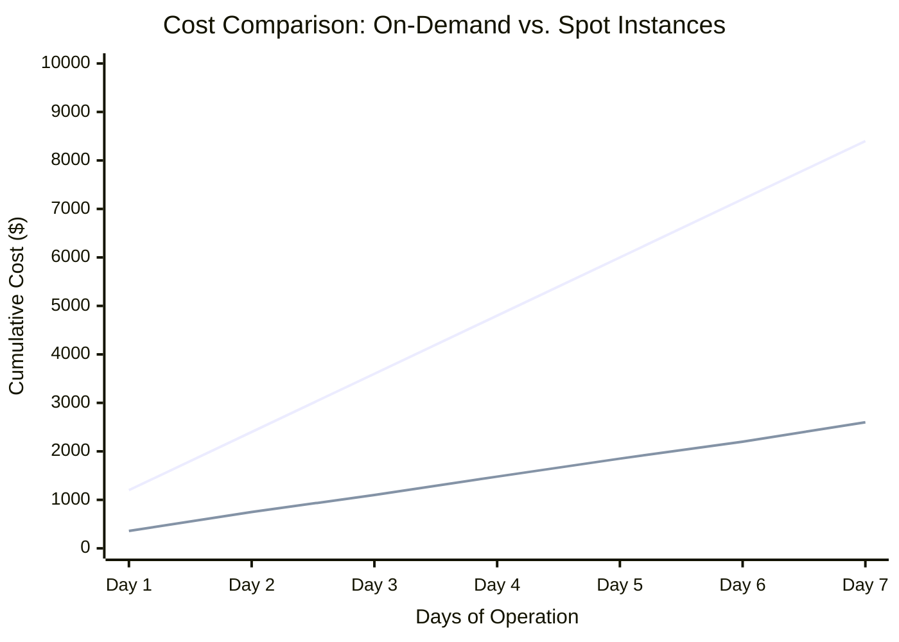
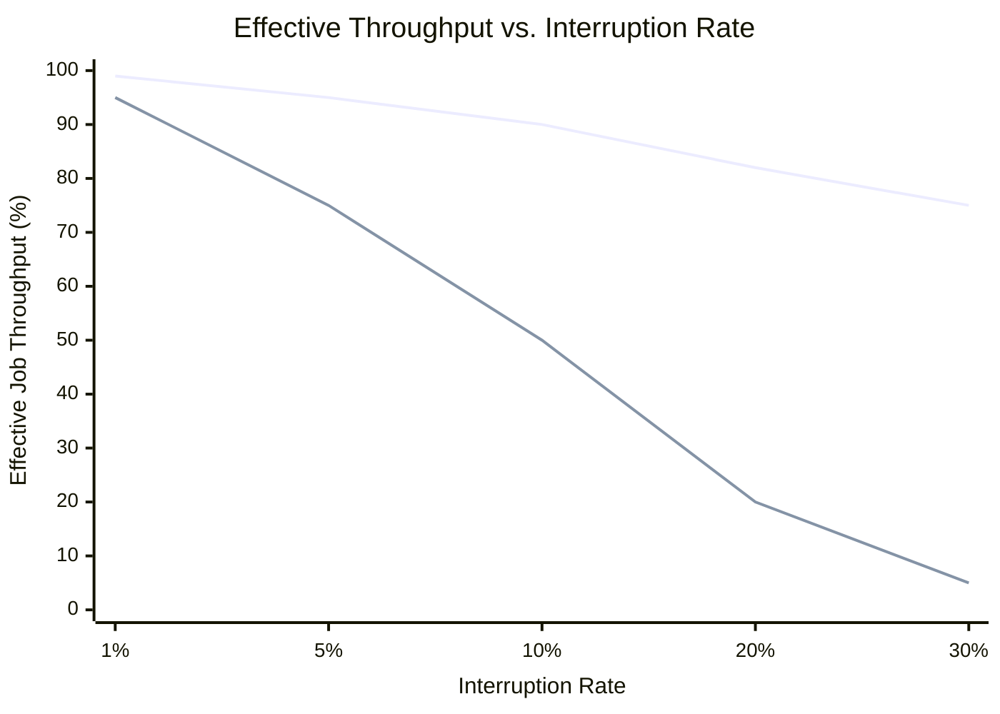
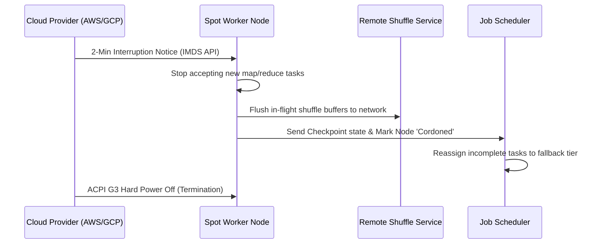

# Transient Spot-Instance MapReduce Framework: Feasibility Analysis

This document expands on **Sections 5 & 6** of the feasibility analysis, providing in-depth research, architectural diagrams, and economic models for running MapReduce workloads reliably on ephemeral cloud capacity.

---

## 5. Cost & Reliability Modeling

The core economic thesis of running MapReduce on transient instances is the arbitrage between the deep discount of spot instances (typically 60-90%) and the overhead cost of dealing with preemptions. 

### 5.1 Cost Variance and TCO Analysis
Spot instances can dramatically lower the Total Cost of Ownership (TCO) for batch processing. However, naive implementations often lose these savings due to the cost of continuous task re-execution. Our model implements a **price ceiling** with an **on-demand fallback** to ensure costs strictly remain below the on-demand baseline.

### 5.2 Throughput and Graceful Degradation Modeling
In a classic Hadoop MapReduce setup, an interruption causes total loss of local shuffle data, leading to massive recomputation of upstream map tasks. The probability of job success drops exponentially with cluster size and job duration. 

In our proposed **Interruption-Aware Framework**, the penalty of a node loss is bounded strictly to the time required to spin up a replacement node and resume from the last sub-task checkpoint.

*(Figure 2: The aware framework degrades gracefully, whereas naive systems suffer a steep throughput collapse as "spot storms" trigger cascading recomputations.)*

---

## 6. Technical Approach

To achieve the resilience and cost savings modeled above, the framework must be re-architected around four critical pillars that treat node death as a frequent, first-class event.

### 6.1 Interruption Hook and Signal Interception
The framework actively listens for preemption warnings from the cloud provider, utilizing the brief window before termination to save state.
*   **AWS (EC2 Spot):** Provides a generous **2-minute warning**. The worker daemon polls the Instance Metadata Service (IMDS) at `http://169.254.169.254/latest/meta-data/spot/instance-action` every 5 seconds. Alternatively, Amazon EventBridge can push these notifications.
*   **GCP (Preemptible/Spot VMs):** Provides a **30-second warning** via an OS-level ACPI G2 Soft Off signal, which triggers a pre-configured shutdown script.

### 6.2 External Remote Shuffle Service (RSS)
**Local-disk shuffle is the single biggest correctness risk on spot workers.** If a node dies, all intermediate map data stored on its disk dies with it. We propose integrating a **Remote Shuffle Service (RSS)** (such as *Apache Celeborn*, *Apache Uniffle*, or *Magnet*).
*   **Decoupled Architecture:** Mappers "push" their output shuffle data over the network directly to a dedicated tier of resilient RSS nodes (or an object store like S3/GCS) instead of writing to local disk.
*   **True Elasticity:** When a Spot Worker is reclaimed, its previously completed map tasks do **not** need to be recomputed because the shuffle data is safely stored in the remote RSS cluster. This enables the cluster to scale down aggressively without data loss.

### 6.3 Fine-Grained Sub-Task Checkpointing
Standard MapReduce only checkpoints at the end of a full task. If a 15-minute reduce task is interrupted at minute 14, all progress is lost. The proposed framework implements **record-batch granularity checkpointing**. 
* As a reducer processes data, it commits offsets to a lightweight, fast distributed store (e.g., Redis or etcd) every 10 seconds.
* Upon receiving the interruption warning, the worker executes a final state flush. The replacement worker simply resumes from the last committed offset, virtually eliminating wasted compute cycles.

### 6.4 Heterogeneous Pools & Bounded Fallback Tier
To mitigate the risk of correlated "Spot Storms" (where an entire AWS Availability Zone reclaims a specific instance type simultaneously), the scheduler uses strategic placement:
*   **Fleet Diversification:** The cluster requests capacity across multiple instance families (e.g., `m5.large`, `c5.large`, `r5.large`) and across multiple AZs. When one pool experiences a price spike or reclamation, others usually remain stable.
*   **On-Demand Fallback Tier:** A strict percentage of the cluster (e.g., 20%) is provisioned on highly reliable **On-Demand instances**. Critical-path tasks, long-running reducers, or tasks that have been preempted more than twice are deterministically routed to this fallback tier to guarantee an absolute upper bound on job latency.

---

## 7. Relevant Literature & Prior Art
The architectural approaches outlined above are heavily supported by recent academic research in fault-tolerant distributed computing.

1. **"Flint: Batch-Interactive Data-Intensive Processing on Transient Servers" (2016)**  
   *OpenAlex ID: W2336721351 | Citations: 79*  
   Demonstrates Spark-based modifications for executing data-intensive jobs on transient EC2 instances by leveraging aggressive state saving and fine-grained lineage recovery.

2. **"Fault-tolerant Workflow Scheduling using Spot Instances on Clouds" (2014)**  
   *OpenAlex ID: W1968700631 | Citations: 125*  
   Explores the mathematical modeling of workflow scheduling algorithms that strictly bound the re-execution cost of interrupted spot instances using checkpoints.

3. **"How to Bid the Cloud" (2015)**  
   *OpenAlex ID: W2082819362 | Citations: 157*  
   A comprehensive economic and probabilistic model proving that strategic bidding coupled with checkpointing maximizes throughput-per-dollar on AWS spot capacity.

4. **"Robust and fault-tolerant scheduling for scientific workflows in cloud computing environments" (2015)**  
   *OpenAlex ID: W2278170307 | Citations: 12*  
   Discusses hybrid pool clustering, utilizing a primary tier of transient instances backed by a small pool of reliable on-demand "fallback" instances to ensure strict deadline completion.
